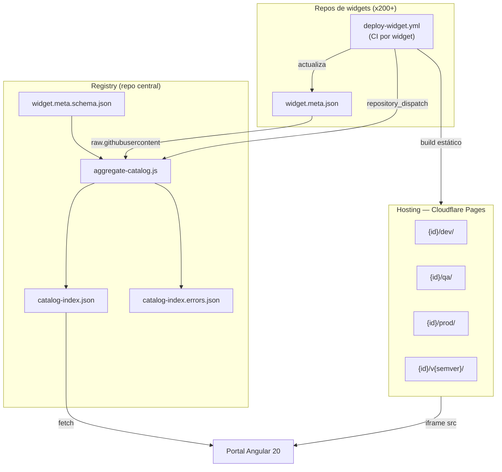
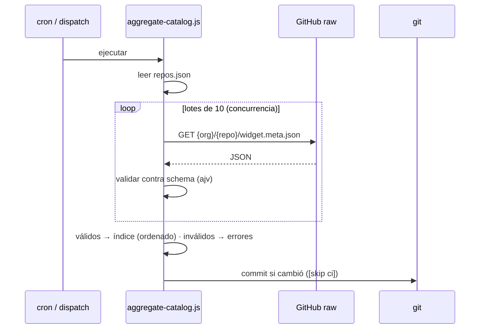

# Arquitectura — Catálogo de Widgets

Documento de diseño de la solución. Acompaña al [`README.md`](../README.md), que
cubre el "cómo correr".

---

## 1. Problema

- **200+ widgets** propios, cada uno en su **propio repo**, sobre **dos stacks**
  (Angular ~100, Flutter ~100).
- Se necesita un **catálogo unificado** donde cualquiera busque un widget, vea su
  demo en vivo, y elija **ambiente** (dev/qa/prod) o **versión** (semver).
- Equipos distintos son dueños de distintos widgets; el catálogo no puede ser un
  cuello de botella ni acoplar el portal a cada repo.

### Por qué no Storybook Composition

Storybook Composition federaría varios Storybooks en uno, pero:

- **No soporta Flutter** de forma nativa — y la mitad del catálogo es Flutter.
- Acoplaría el catálogo al ecosistema Storybook/JS, dejando fuera Widgetbook
  (Flutter) y cualquier herramienta futura.

La abstracción que **sí** sirve para ambos stacks es la más simple: **una URL a un
build estático**. El portal no sabe (ni le importa) si detrás hay Angular, Flutter,
Storybook o Widgetbook: solo embebe una URL en un `<iframe>`.

---

## 2. Vista de componentes



Piezas y responsabilidad única de cada una:

| Componente | Responsabilidad | NO hace |
|---|---|---|
| Repo de widget | Construir su demo estática; declarar su metadata | No conoce el portal ni a otros widgets |
| Hosting | Servir builds bajo rutas predecibles | No tiene lógica |
| Registry | Recolectar, **validar** y agregar metadata | No construye ni despliega |
| Portal | Descubrir y **mostrar** | No construye, no valida, no hostea |

El acoplamiento es por **contrato de datos** (el JSON Schema) y por **convención de
URLs**, no por código compartido.

---

## 3. Convención de URLs

```
widgets.tuorg.dev/{id}/{dev|qa|prod}/    → ambiente (mutable, "última de…")
widgets.tuorg.dev/{id}/v{semver}/        → versión (inmutable)
```

- **Predecible**: conociendo `id` y `target` se arma la URL sin consultar nada.
- **Inmutable por versión**: `v2.1.0/` nunca cambia → cacheable "para siempre"; un
  rollback es apuntar a otra versión, no re-desplegar.
- **`base-href`**: cada build se compila con `--base-href "/{id}/{target}/"` para
  que sus assets resuelvan dentro del sub-path (clave en Angular y Flutter web).

---

## 4. Modelo de metadata

### Nivel 1 — `widget.meta.json` (por repo)

Lo produce el CI del widget. Validado contra
[`widget.meta.schema.json`](../registry/widget.meta.schema.json) (JSON Schema
draft-07). Reglas clave:

- `id`: `^[a-z0-9]+(-[a-z0-9]+)*$`, 3–64 chars, == nombre del repo.
- `stack`: enum `angular | flutter`. `stackVersion`: semver.
- `repo` y `environments.*.url`: `format: uri` + `^https://`.
- `environments`: objeto **fijo** `{dev, qa, prod}` (acceso por clave conocida).
- `versions[]`: array creciente con URL inmutable y `releasedAt` (`format: date`).
- `additionalProperties: false` en todos los niveles → un campo no declarado es
  error de validación (evita que metadata sucia entre al índice).

### Nivel 2 — `catalog-index.json` (registry)

```jsonc
{
  "generatedAt": "2026-06-18T15:00:00Z",
  "totalWidgets": 214,
  "byStack": { "angular": 108, "flutter": 106 },
  "widgets": [ /* todos los widget.meta.json válidos, ordenados por id */ ]
}
```

Es el **único** archivo que el portal consume. Ordenar por `id` mantiene los diffs
de git estables (un deploy no reordena todo el archivo).

---

## 5. El agregador

[`aggregate-catalog.js`](../registry/aggregate-catalog.js):



Decisiones:

- **Tolerante a fallos**: un widget con metadata inválida va a
  `catalog-index.errors.json` y **no rompe** la corrida (los otros 199 entran).
- **Lotes de 10** concurrentes para no saturar la API de GitHub; con `GITHUB_TOKEN`
  el rate limit sube.
- **Commit sólo si cambió** (`git diff --staged --quiet`) y con `[skip ci]` para no
  generar loops de CI.
- **`--source local|remote`**: el mismo script corre contra `mock-widgets/` (POC,
  sin red) o contra GitHub raw (producción).

Ejemplo real de este POC: 10 repos → **9 válidos**, **1 inválido**
(`bad-widget`, que dispara 9 errores de schema capturados en el reporte).

---

## 6. El portal (Angular 20)

### Capas

```
core/      app-config (token DI)  ·  catalog.models  ·  CatalogService  ·  DemoUrlService
features/  catalog-list (buscador+filtros)  ·  widget-card  ·  widget-detail (visor)
```

- **`CatalogService`** es la única fuente de verdad: hace `fetch` del índice y lo
  expone como signals (`widgets`, `counts`, `owners`, `tags`, `status`). Toda la UI
  deriva de ahí con `computed`.
- **`DemoUrlService`** aísla el cálculo de la URL del iframe. Es el punto exacto
  donde POC y prod difieren:
  - prod → devuelve la URL real del meta del widget;
  - POC → reescribe a la demo local parametrizada.
- **`linkedSignal`** en el detalle: la selección de ambiente/versión se **reinicia
  a `prod`** automáticamente cuando cambia el widget, sin un `effect` manual.
- **Rutas lazy**: `catalog-list` y `widget-detail` son chunks separados.

### Seguridad del iframe

- `DomSanitizer.bypassSecurityTrustResourceUrl` sobre una URL construida por
  nosotros (no input libre del usuario).
- Atributo `sandbox="allow-scripts allow-same-origin allow-forms allow-popups"` y
  `referrerpolicy="no-referrer"`.
- En producción, las demos viven en otro origen (`widgets.tuorg.dev`), aislando el
  portal del código de cada widget.

---

## 7. Actualización del índice: cron vs. dispatch

- **Hoy (fallback)**: cron cada 30 min reconstruye el índice. Simple, pero hay
  latencia y trabajo desperdiciado cuando nada cambió.
- **Objetivo**: cada `deploy-widget.yml` emite un `repository_dispatch`
  (`widget-deployed`) al registry tras un deploy exitoso → el índice se rehace
  **sólo cuando hay algo nuevo**. Ya está cableado en el template y en el workflow;
  el cron queda como red de seguridad.

---

## 8. Escalado a 200+ widgets

- **Agregador**: 200 fetches en lotes de 10 con token ≈ segundos. Si creciera a
  miles, conviene pasar a dispatch puro + caché por `ETag`.
- **Portal**: `catalog-index.json` de 200 widgets es pequeño (decenas de KB). El
  listado con 200 tarjetas se beneficia de `@for` con `track` (ya está); si hace
  falta, virtual scroll del CDK.
- **Hosting**: rutas por prefijo escalan linealmente; el peso real está en los
  builds de Flutter web (de ahí la preferencia por un CDN global).

---

## 9. Decisión de hosting

| Opción | A favor | En contra |
|---|---|---|
| **Cloudflare Pages** (preferida) | Dominio custom, deploys por branch, **CDN global** (clave para Flutter web pesado), free tier generoso | Otro proveedor en el stack |
| AWS S3 + CloudFront | Encaja si ya hay AWS; prefix por widget | Más plomería (OAC, invalidaciones) |
| GitHub Pages (repo central) | Lo más simple | Límite de tamaño de repo al crecer el histórico de versiones |

**Recomendación: Cloudflare Pages.** El factor decisivo es el CDN global frente a
builds de Flutter web pesados servidos a toda la organización.
